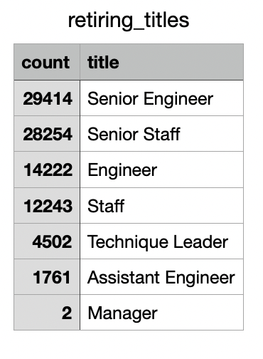
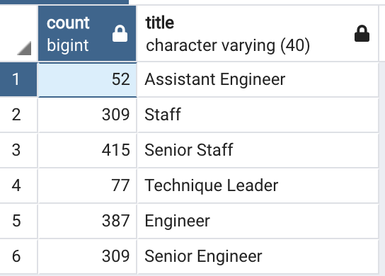
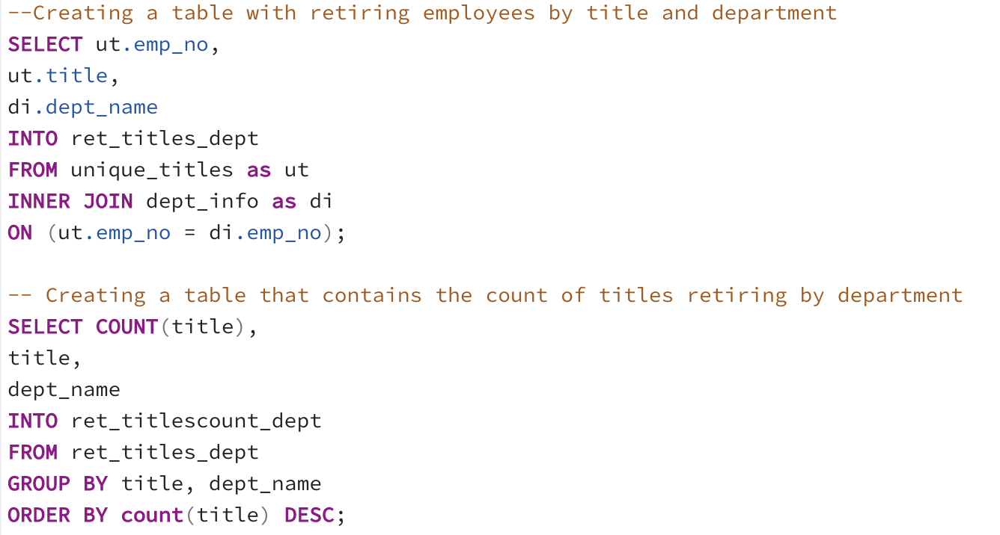
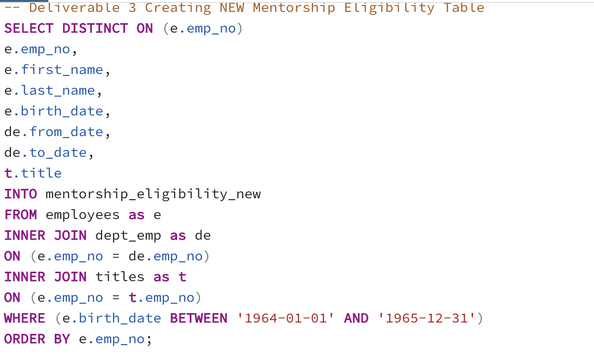
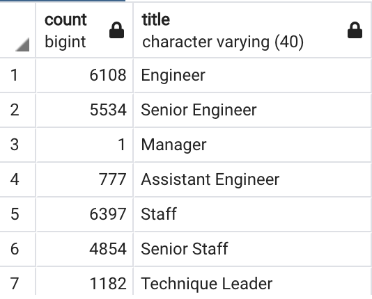
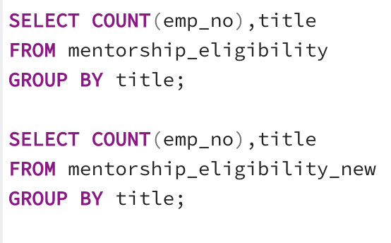

# **Pewlett-Hackard Analysis**

## **Overview:**

The purpose of this analysis is to help Pewlett Hackard collect details about its retiring workforce in order to prepare for retirement packages and plan for replacement of the vacant positions. Here, we determine the number of current employees retiring from each department, their titles and identify employees who are eligible to participate in a mentorship program.

## **Results:**

### **Retiring Titles**:
This table provides information on the titles of the retiring employees and how many employees belonging to a certain title are retiring. An image of the table can be seen below:

The same can also be accessed here:[retiring_titles.csv](Data/retiring_titles.csv)

-  From the data, it can be seen that about 90000+ people will be retiring at nearly the same time period, which is a very large number and needs a considerable amount of planning to fill up positions.

-  The largest number of retirees will belong to the senior engineer  and senior staff positions. Therefore there will be a large number of vacancies in the Senior Engineer and Senior Staff positions that will need to be filled. 

- The relative number of retirees in the Engineer and Assistant Engineer positions is lower, which could mean that the upcoming senior position vacancies could additionally be filled internally as well, while outside hires could be considered for Engineer positions and fresh graduates could be considered for Assistant engineer positions. A similar strategy could be followed for the Staff and Senior Staff positions as well. A decision can be made based on the availability of qualified candidates during the hiring period.

### **Mentorship program:**
A mentorship eligibility table is created to identify employees who may be eligible to participate in a mentorship program.

- There are 309 prospective mentors in the Senior Engineer position and 415 in the Senior Staff position. When compared with the number of possible vacancies that may get filled with new staff, it would be neccesary to have more mentors especially for these two positions. The number of mentors for each position can be seen from the image below:

-  Based on this number of mentors for the different roles, the number of trainees per mentor would be incredibly high and unrealistic when compared with the number of positions that would be filled in each role. The number of open positions by title can be arrived at from the Retiring_titles table above.

## **Summary:**

**__Roles to be filled after silver tsunami:__**

 While all 7 roles will have people retiring during the silver tsunami, the main roles that will need to be filled are that of Senior Engineer, Senior Staff,Engineer and Staff. These 4 positions account for the maximum number of prospective retirees at about 93%.

Another way of analyzing the data is by creating a table that contains the count of retiring titles by department. The same can be done by the following queries.

A new table is created that contains the total number of positions that will be vacant by title and by department, based on retirements. The data from this table can be accessed here: [ret_titlescount_dept.csv](Data/ret_titlescount_dept.csv)

The data from this table will help each department plan for prospective vacancies and roles that will open up within their department. It will also help the company determine the needs by department and plan which departments to prioritize first when hiring new employees.

**__Are there enough mentors?:__**

Also, as seen from the results above, there aren't enough employees across the different roles to handle the mentorship of the large number of new employees that would be joining the workforce. This is especially the case with Senior Engineer and Senior Staff positions. 

At present the list of mentors are current employees born between January 1, 1965 and December 31, 1965. In order to increase the number of mentors, the company will have to see if they can widen the criteria for mentors.For instance, when we increase the timeframe for birthdate from January 1 1964 to December 31 1965, the number of mentors for the various roles increases drastically thereby giving a more realistic number of trainees per mentor. The following query can be used to create a new table of mentors called "mentorship_eligibility_new":

The difference in the number of mentors by title can be seen in the images below:

**Mentor count by Title original:**

**Mentor count by Title New:**

The following query was used to extract the Mentor count by title:

